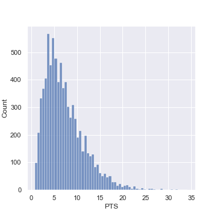
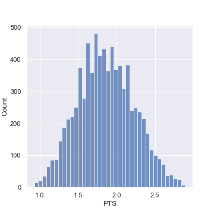
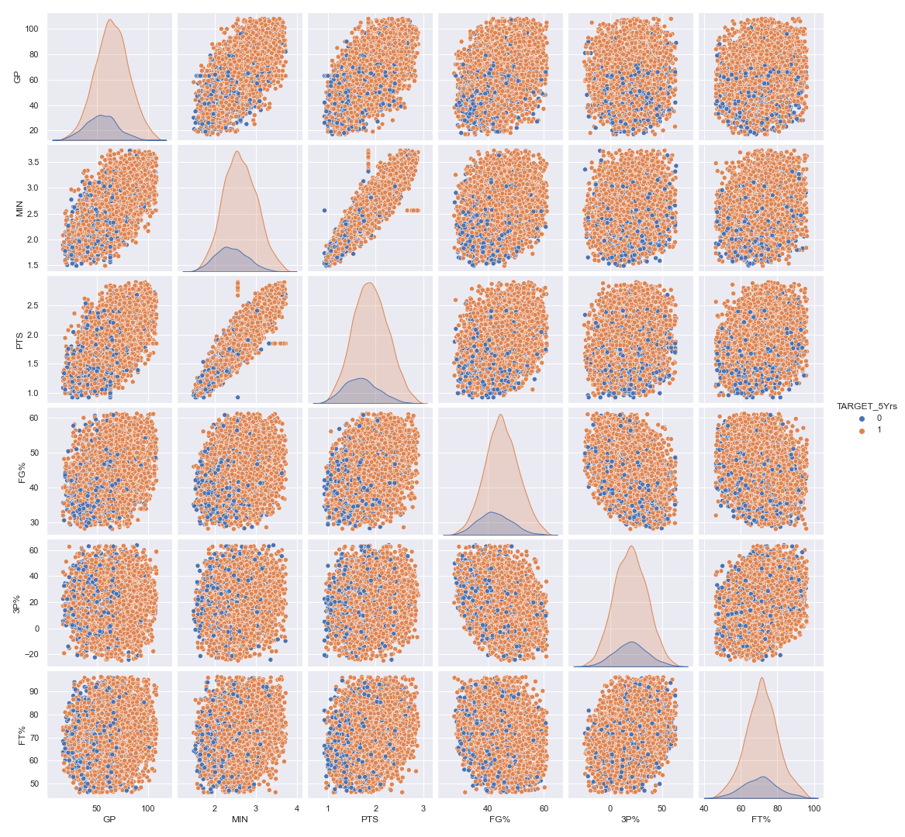
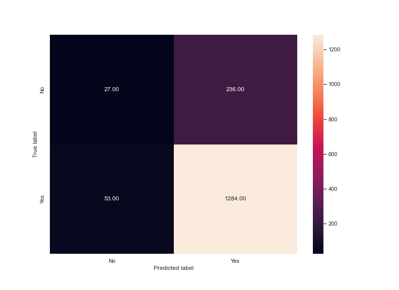
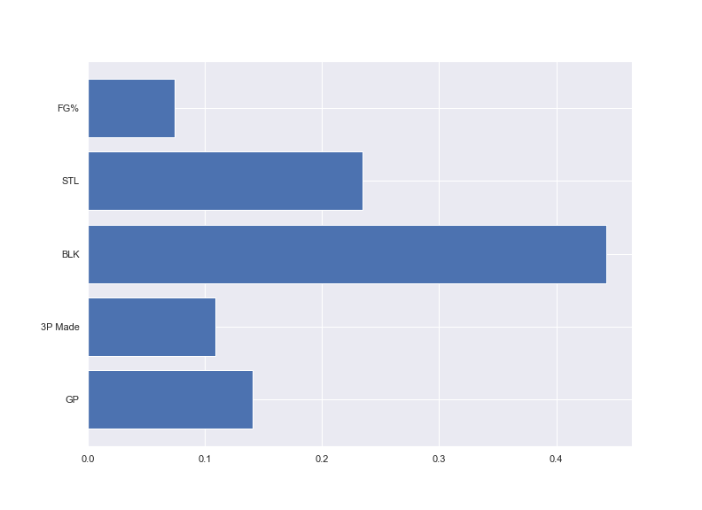

# Business Understanding

The NBA is a big business in anyone's language and by number of different metrics. The NBA secured more than 1.46 billion in sponsorship in 2021[^ae82]. There are currently 613 players in the NBA across 30 different clubs[^7d7d]. Of those 613 players 60 of them were selected in the draft 2021 draft, in addition to these 60 another 32 have played at least one game in the NBA[^d4f1]. As part of this whole process the fight for the next generation of talent is fierce. There is a rookie salary cap and players can be paid more or less than the award wages dependant on the value proposition to the club. The ability to attract and grow the next generation of players is essential to successful teams - how much is invested in these players early in their careers will matter. If machine learning can assist in predicting who will play for more than 5 years the implication is that stability can be built into a roster and winning teams built. Winning teams are built over time and all have great players with longevity as a hallmark of their careers.

## Determine the Business Objectives

The objective of this projects was to determine if it was possible to predict which players will play more than 5 years based on various player statistics. Ideally the model will be simple enough to enable understanding and key markers to be derived but this isn't a pre-requisite.

## Assess the Situation

Currently there is no one factor that can be determined to predict if players will have a career of more than 5 years. There is however good historical data sets on players that have played more than 5 years. These player statistics are clean and complete. What is not catered for in the data set is the time variable. The statistics for each of the players are not considered to have changed over time and even though there are 8000 records in the train data set there are only 4509[^54da] players have ever appeared on an NBA roster over the 75 year history of the NBA. So it appears that some of our data is taken from both NBA and college stats. While this may help it is likely to lead to an inconsistency in both the results of the model and the when interpreting against the intended context. For the purposes of this paper provided will be the data used rather than sourcing another set of data that is only from NBA with players that have careers of either more or less than 5 years.

The model produced will likely be used internally in a single organisation but if possible it should be able to be deployed on a secure server for others to access and use as part of roster related decisions.

# Data Understanding

The Data used in this analysis was taken as a set of data that was provided by an organisation as such data from other sources will not be added.

## Describe the Data

The Data was split into a training set and a testing set of Data. The training set was used to develop and test models and the testing set was used to make predictions on and formed the basis of the submissions. The training set of Data was 8000 rows long, it had 8000 unique entries. The testing set had 3799 unique entries. There were 21 different features in the Data set (inclusive of the 'id' and the 'prediction target').

The Data dictionary is below:

- Id - Player Identifier
- GP - Games Played
- MIN - Minutes Played
- PTS - Points Per Game
- FGM - Field Goals Made
- FGA - Field Goals Attempts
- FG% - Field Goals Percent
- 3P Made - 3-Points Made
- 3PA - 3-Points Attempts
- 3P% - 3-Points Percent
- FTM - Free Throw Made
- FTA - Free Throw Attempts
- FT% - Free Throw Percent
- OREB - Offensive Rebounds
- DREB - Defensive Rebounds
- REB - Rebounds
- AST - Assists
- STL - Steals
- BLK - Blocks
- TOV - Turnovers
- TARGET_5Yrs - Outcome: 1 if career length >= 5 years, 0 otherwise

### Measures of central tendency

The three measures of central tendency that were considered were the mean, median and the mode. These all played a part in different levels when considering the Data. The overarching description of the Data was the skewness of the majority of the features. Ideally Data will have a skewness between -1 and 1, The figures below highlight the extreme positive skewness of 12 of the features in the Data.

Feature     | Skewness
----------- | ---------
AST         | 1.774748
DREB        | 1.388891
FTM         | 1.333701
REB         | 1.332728
OREB        | 1.316342
FTA         | 1.285804
FGA         | 1.285183
PTS         | 1.270330
FGA         | 1.266272
STL         | 1.209020
TOV         | 1.208849
MIN         | 1.100555
BLK         | 0.414711
FG%         | 0.142836
FT%         | 0.082300
3P%         | 0.038277
3PA         | 0.031991
3P Made     | 0.014764
GP          | -0.019078
TARGET_5Yrs | -1.792011

Of note the Target is significantly skewed in the negative direction. This is indicative of the imbalanced nature of the target variable. The boxplot below highlights the skewness in the Data as well as some of the outliers for each of the features.

### Measures of variability

The boxplot below highlights some of the variability across the features in the Data. The range and the

This highlights a general skewness of the features in Data and also the existence of outliers for the majority of the features.

## Explore the Data

The pair-plot below builds on the box plot above by demonstrating the relative weighting of the target variable in key distributions.

The skewed distrubutions along with the imbalanced target variable will need treatment as part of the Data preparation stage. The imbalanced target variable is highlighted below:

# Data Preparation

The Data was prepared before the modelling process. Statistical anomalies were removed or adjusted and the Data saved as a fresh .csv file in the project directory for future use.

## Select the Data

The entire Data set was cleaned and adjusted to enable the Data to be used readily across the different models.

## Clean the Data and Feature Generation

The Data required minimal cleaning. There was a requirement to remove the outliers from the Data set and also to normalise the features. Outliers were treated by replacing them with values from the outer edges of the 95th percentile in the range of the feature. This was done to ensure the maximum amount of Data was available to develop models from. The normalisation of the Data was also done by applying a cubic method to the highly skewed features.

The imbalance of the target variable was handled by oversampling using Synthetic Minority Oversampling Technique (SMOTE)[^7fbf]. By doing this the number of observations for the Data on which the model was built increased from 6400 to 10670\. This meant that the two possible outcomes in the classification model were then evenly weighed.

# Modelling

The modelling developed was for a classification model. This was done using a combination of both features selected in combination with different modelling techniques.

## Select the Modelling Techniques

Two principle modelling techniques were used in developing the model, these were regression modelling and decision trees. The regression modelling was done using logistic regression across incorporating both the Ridge(L2) and Lasso(L1) penalties for the model. The tree based model developed was XGBoost. The XGBoost model tended to overfit whereas the logistic regression model tended to under fit but was far more generalisable and useful.

## Build the Model

The logistic regression model was built

## Assess the Model

# Evaluation

## Evaluate the Results

## Review Process

## Determine the Next Steps

# Deployment

## Plan the Deployment

## Plan and Monitoring and Maintenance

## Produce Final Report

## Review Project

# Experiment Background

One of the challenges for rising NBA stars is where to focus their efforts on skills that should be developed. Related to this is the the investment in different players based on different game statistics for managers and coaches. This experiment is seeking to better understand the variables that contribute as key markers to career success. Career success is defined as players that will be kept on the roster for more than 5 years.

## Business Objectives

An understanding for player managers and players themselves of which key stats will lead to career longevity. It could also assist in directing time and effort both in recruiting for managers and where players should focus efforts in skill development.

## Hypothesis

It is possible to model career performance based on key statistics that are already gathers by the different basketball leagues.

## Experiment Objectives

Determine which features are correlated with a career of 5 years or longer then develop a model based on the different features. It will be a classification model.

# Experiment Details

The initial model will be developed using xgBoost as a classification model. Features will be added in one at a time to better understand and develop a level of explainability to the model thereby assisting with the interpretation for both players and managers.

## Data Preparation

The Data was split into a train and test set. There were 8000 entries in the training Data set and these were further broken down into test and train data set - the proportion for train test was 80/20.

## Feature Engineering

Following on from previous modelling effort a focus for this experiment was to 'clean' the data thoroughly. This involved the removal of outliers in addition to removing the majority of the skewness from the features

### Skewness

The skewness of the training data prior to any transformation can be seen below:

The skewness was removed from the Data by applying a cubed root to features that were found to have a skewness of greater than 1 or less than -1\. The data was heavily skewed to the right generally as such a cube root transformation was made on the following variables:

['AST', 'DREB', 'FTM', 'REB', 'OREB', 'FTA', 'FGM', 'PTS', 'FGA', 'STL', 'TOV', 'MIN']

Example features with skewness removed are below for comparison:

The remainder of the variables were not skewed or were within acceptable parameters.

### Removal of Outliers

The boxplot below demonstrates the number of outliers for each of the variables.

To remove the outliers from the Data the Tukeys method was used. This was done by taking both the probable and possible outliers and replacing them with the median. This was chosen as it is a robust method of dealing with outliers. The resultling boxplot is below for comparison.

The resulting pair plot following both the removal of the skewness of and the treatment of the outliers is below.

It can be seen that there are trends between the different classification in the features.

The final consideration in this experimental round was the imbalanced nature of the Data. The plot below highlights this.

We can see that the target variable is unbalanced, to account for this SMOTE was used as an oversampling strategy.

## Modelling

The model was developed using the XGBoost algorithm. The model was developed in an additive manner whereby features were added to the model in order to ensure the best model was kept as simple as possible. The model parameters were as follows:

- max_depth=3,
- learning_rate=0.01,
- nfold=100,
- n_estimators=2500,
- subsample = .9,
- reg_alpha = .3,
- gamma = 10,
- colsample_bytree = 1,
- objective='binary:logistic',
- booster='gbtree')

# Experiment Results

The results of the experiment yielded a result of .6911 when they were submitted on the competition. This is close to the higher scores in the competition.

## Technical Performance

The model trained quickly (93 sec) and the performance of the test and train sets were comparable. The graphic below highlights the performance on the test data as part of the model performance.

The confusion matrix below highlights the performance of the model on how the number of false positive and false negatives the model is producing.

The implication is that there are 389 incorrectly categorised players from the test data. 300 are players that were considered to make the target career length but in fact don't make it that far.

## Business Impact

The impact of these errors is that investment and energy will be applied to players that are unlikely to reach the career milestone of 5 years.

## Encountered Issues

There were some issues with feature selection. The feature importance graph below highlights the relative importance of the features in the model.

As different features were removed based on the results of this graphic the interactions between the variables were hard to predict and as such all features were kept in the model to offer a standard manner of selecting the features.

# Future Experiment

Feature selection is the next step in the process to ensure the model is both as simple as possible and explainable in business terms.

## Key Learning

The cleaning of both the outliers and the skewness in the Data will enable other models to be fit as part of future experiments. The parameters for the xgBoost model influence the outcome significantly - the parameters in the model above were a compromise between the processing speed and not overfitting the model.

## Recommendations

This model could be used in conjunction with other models to determine the best overall outcome for an individual player based on the Data gathered during the season.

[^54da]: https://www.sportskeeda.com/basketball/how-many-players-played-nba
[^7d7d]: https://www.nba.com/players
[^7fbf]: https://en.wikipedia.org/wiki/Oversampling_and_undersampling_in_data_analysis#SMOTE
[^ae82]: https://www.cnbc.com/2021/06/29/nba-set-record-1point46-billion-in-sponsorship-revenue-this-season.html
[^d4f1]: https://en.wikipedia.org/wiki/2021_NBA_draft
