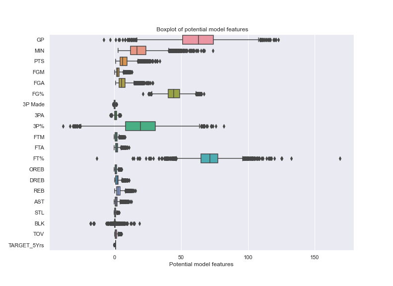
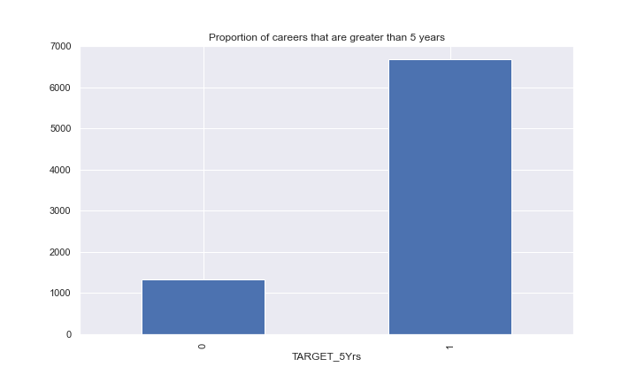

# Business Understanding

The NBA is a big business in anyone's language and by number of different metrics. The NBA secured more than 1.46 billion in sponsorship in 2021[^ae82]. There are currently 613 players in the NBA across 30 different clubs[^7d7d]. Of those 613 players 60 of them were selected in the draft 2021 draft, in addition to these 60 another 32 have played at least one game in the NBA[^d4f1]. As part of this whole process the fight for the next generation of talent is fierce. There is a rookie salary cap and players can be paid more or less than the award wages dependant on the value proposition to the club. The ability to attract and grow the next generation of players is essential to successful teams - how much is invested in these players early in their careers will matter. If machine learning can assist in predicting who will play for more than 5 years the implication is that stability can be built into a roster and winning teams built. Winning teams are built over time and all have great players with longevity as a hallmark of their careers.

## Determine the Business Objectives

The objective of this projects was to determine if it was possible to predict which players will play more than 5 years based on various player statistics. Ideally the model will be simple enough to enable understanding and key markers to be derived but this isn't a pre-requisite.

## Assess the Situation

Currently there is no one factor that can be determined to predict if players will have a career of more than 5 years. There is however good historical data sets on players that have played more than 5 years. These player statistics are clean and complete. What is not catered for in the data set is the time variable. The statistics for each of the players are not considered to have changed over time and even though there are 8000 records in the train data set there are only 4509[^54da] players have ever appeared on an NBA roster over the 75 year history of the NBA. So it appears that some of our data is taken from both NBA and college stats. While this may help it is likely to lead to an inconsistency in both the results of the model and the when interpreting against the intended context. For the purposes of this paper provided will be the data used rather than sourcing another set of data that is only from NBA with players that have careers of either more or less than 5 years.

The model produced will likely be used internally in a single organisation but if possible it should be able to be deployed on a secure server for others to access and use as part of roster related decisions.

# Data Understanding

The Data used in this analysis was taken as a set of data that was provided by an organisation as such data from other sources will not be added.

## Describe the Data

The Data was split into a training set and a testing set of Data. The training set was used to develop and test models and the testing set was used to make predictions on and formed the basis of the submissions. The training set of Data was 8000 rows long, it had 8000 unique entries. The testing set had 3799 unique entries. There were 21 different features in the Data set (inclusive of the 'id' and the 'prediction target').

The Data dictionary is below:

- Id - Player Identifier
- GP - Games Played
- MIN - Minutes Played
- PTS - Points Per Game
- FGM - Field Goals Made
- FGA - Field Goals Attempts
- FG% - Field Goals Percent
- 3P Made - 3-Points Made
- 3PA - 3-Points Attempts
- 3P% - 3-Points Percent
- FTM - Free Throw Made
- FTA - Free Throw Attempts
- FT% - Free Throw Percent
- OREB - Offensive Rebounds
- DREB - Defensive Rebounds
- REB - Rebounds
- AST - Assists
- STL - Steals
- BLK - Blocks
- TOV - Turnovers
- TARGET_5Yrs - Outcome: 1 if career length >= 5 years, 0 otherwise

### Measures of central tendency

The three measures of central tendency that were considered were the mean, median and the mode. These all played a part in different levels when considering the Data. The overarching description of the Data was the skewness of the majority of the features. Ideally Data will have a skewness between -1 and 1, The figures below highlight the extreme positive skewness of 12 of the features in the Data.

Feature     | Skewness
----------- | ---------
AST         | 1.774748
DREB        | 1.388891
FTM         | 1.333701
REB         | 1.332728
OREB        | 1.316342
FTA         | 1.285804
FGA         | 1.285183
PTS         | 1.270330
FGA         | 1.266272
STL         | 1.209020
TOV         | 1.208849
MIN         | 1.100555
BLK         | 0.414711
FG%         | 0.142836
FT%         | 0.082300
3P%         | 0.038277
3PA         | 0.031991
3P Made     | 0.014764
GP          | -0.019078
TARGET_5Yrs | -1.792011

Of note the Target is significantly skewed in the negative direction. This is indicative of the imbalanced nature of the target variable. The boxplot below highlights the skewness in the Data as well as some of the outliers for each of the features.

### Measures of variability

The boxplot below highlights some of the variability across the features in the Data. The range and the

This highlights a general skewness of the features in Data and also the existence of outliers for the majority of the features.

## Explore the Data

The pair-plot below builds on the box plot above by demonstrating the relative weighting of the target variable in key distributions.

The skewed distrubutions along with the imbalanced target variable will need treatment as part of the Data preparation stage. The imbalanced target variable is highlighted below:

# Data Preparation

The Data was prepared before the modelling process. Statistical anomalies were removed or adjusted and the Data saved as a fresh .csv file in the project directory for future use.

## Select the Data

The entire Data set was cleaned and adjusted to enable the Data to be used readily across the different models.

## Clean the Data and Feature Generation

The Data required minimal cleaning. There was a requirement to remove the outliers from the Data set and also to normalise the features. Outliers were treated by replacing them with values from the outer edges of the 95th percentile in the range of the feature. This was done to ensure the maximum amount of Data was available to develop models from. The normalisation of the Data was also done by applying a cubic method to the highly skewed features.

The imbalance of the target variable was handled by oversampling using Synthetic Minority Oversampling Technique (SMOTE)[^7fbf]. By doing this the number of observations for the Data on which the model was built increased from 6400 to 10670\. This meant that the two possible outcomes in the classification model were then evenly weighed.

# Modelling

The modelling developed was for a classification model. This was done using a combination of both features selected in combination with different modelling techniques.

## Select the Modelling Techniques

Two principle modelling techniques were used in developing the model, these were regression modelling and decision trees. The regression modelling was done using logistic regression across incorporating both the Ridge(L2) and Lasso(L1) penalties for the model. The tree based model developed was XGBoost. The XGBoost model tended to overfit whereas the logistic regression model tended to under fit but was far more generalisable and useful.

## Build the Model

Two different models were built and experimented with, a logistic regression model and a XGBoost model. The logistic regression model was built using the Ridge regression method (L2). This was found to be the best regression method when compared to the Lasso method (L1). As part of the process a Grid Search 10 fold cross validation was completed to determine the best hyper-parameters. This model was relatively quick to fit(less than 5 mins)

The second model developed was a XGBoost model. The XGBoost model was developed with a Grid Search cross validation with 3 fold cross validation being used to reduce the fitting time. This model took a little over 5 hrs to fit.

## Assess the Model

When assessing the models accuracy and precision were considered - the following tables below highlight the relative values for both the logistic model and the XGBoost model.

logistic Model   | Precision | Recall | f1-score | support
---------------- | --------- | ------ | -------- | -------
                 | 0         | 0.62   | 0.03     | 0.06    | 266
                 | 1         | 0.84   | 1.00     | 0.91    | 1334
accuracy         |           |        | 0.84     | 1600    |
macro average    | 0.73      | 0.51   | 0.48     | 1600    |
weighted average | 0.80      | 0.84   | 0.77     | 1600    |

XGBoost model    | Precision | Recall | f1-score | support
---------------- | --------- | ------ | -------- | -------
0                | 0.33      | 0.10   | 0.15     | 263
1                | 0.84      | 0.96   | 0.90     | 1337
accuracy         |           |        | 0.82     | 1600
macro average    | 0.59      | 0.53   | 0.53     | 1600
weighted average | 0.76      | 0.82   | 0.78     | 1600

# Evaluation

The roc_auc score for the logistic model was _0.683_, this figure is a little less than the training figure for the model which was _0.703_. The implication is that the model may not be as generalisable as originally thought and it may be overfitting slightly. The roc_auc for the XGBoost model was _0.979_ which is an excellent result but the roc_auc for the test data was _0.66_. This implies that the model was overfitting significantly and isn't generalisable beyond the training data. In this instance the XGBoost model while initially thought to be better than the logistic model isn't as generalisable or useful in this instance.

The confusion matrix for the two models is below:

## Determine the Next Steps

The next steps for the model will be to confirm the model to be used when considering the explainability vs the accuracy required for the model in the different contexts. For example, the XGBoost model uses fewer inputs and can therefore be considered more explainable because it is simpler whereas the logistic model uses all of the features making it harder to explain across the various model features. This is because the interactions between the variables can be hard to predict.

## Key Learning

Some of the issues faced when developing the model resided primarily in the cleaning of the Data and determining the best method for model development. The techniques for cleaning the Data were focused on ensuring the Data adhered to statistical conventions that satisfied the assumptions that underpin logistical modelling, low variance and low bias.

The generalisable nature of the model was another key consideration when determining the best approach to deploy. The XGBoost model was able to better 'learn' from the training Dat but the overcompensation meant that it wasn't able to be used for other settings and will ultimately add little value in the real world.

[^54da]: https://www.sportskeeda.com/basketball/how-many-players-played-nba
[^7d7d]: https://www.nba.com/players
[^7fbf]: https://en.wikipedia.org/wiki/Oversampling_and_undersampling_in_data_analysis#SMOTE
[^ae82]: https://www.cnbc.com/2021/06/29/nba-set-record-1point46-billion-in-sponsorship-revenue-this-season.html
[^d4f1]: https://en.wikipedia.org/wiki/2021_NBA_draft
