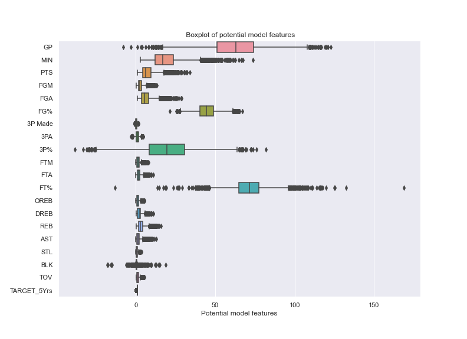
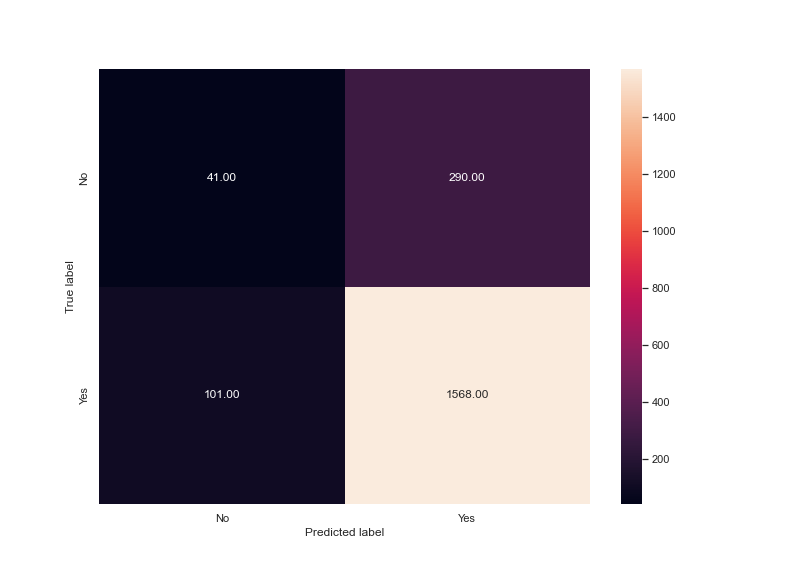

# Experiment Background

One of the challenges for rising NBA stars is where to focus their efforts on skills that should be developed. Related to this is the the investment in different players based on different game statistics for managers and coaches. This experiment is seeking to better understand the variables that contribute as key markers to career success. Career success is defined as players that will be kept on the roster for more than 5 years.

## Business Objectives

An understanding for player managers and players themselves of which key stats will lead to career longevity. It could also assist in directing time and effort both in recruiting for managers and where players should focus efforts in skill development.

## Hypothesis

It is possible to model career performance based on key statistics that are already gathers by the different basketball leagues.

## Experiment Objectives

Determine which features are correlated with a career of 5 years or longer then develop a model based on the different features. It will be a classification model.

# Experiment Details

The initial model will be developed using xgBoost as a classification model. Features will be added in one at a time to better understand and develop a level of explainability to the model thereby assisting with the interpretation for both players and managers.

## Data Preparation

The Data was split into a train and test set. There were 8000 entries in the training Data set and these were further broken down into test and train data set - the proportion for train test was 80/20.

## Feature Engineering

Following on from EDA it can be seen that some of the Data needed cleaning prior to the model being developed. The boxplot below highlights this.

By selecting some features in the Data set and running a pairplot on them we can better understand the distribution in addition to the relationship between the features and the career length. The figure below highlights some key relationships that may impact the model in the future.

The final consideration in this experimental round was the imbalanced nature of the Data. The plot below highlights this.

We can see that the target variable is unbalanced, to account for this SMOTE was used as an oversampling strategy.

## Modelling

The initial model was developed using the XGBoost algorithm. The model was developed in an additive manner whereby features were added to the model in order to ensure the best model was kept as simple as possible.

# Experiment Results

The results of the experiment yielded a result of .622 when they were submitted on the competition. Thisn is a fair way from the higher scores (10pts).

## Technical Performance

The model trained quickly and converged but the test data didn't converge to zero as the train data did. The grahic below highlights the issues with the performance on the test data as part of the model performance.

The confusion matrix below highlights the performance of the model on how the number of false positive and false negatives the model is producing.

The implication is that there are 389 incorrectly categorised players from the test data. 300 are players that were considered to make the target career length but in fact don't make it that far.

## Business Impact

The impact of these errors is that investment and energy will be applied to players that are unlikely to reach the career milestone of 5 years.

## Encountered Issues

The model appears to be overfitting on the training data based on the results above. The differences between building a model on cleaned data vs applying the model to the 'dirty' data.

# Future Experiment

To avoid overfitting the option to stop the model training early could be considered. Rather than build the model in a progressing sense the option to build the model in a regressive sense based around variable importance being careful of the interactions as the model evolves.

## Key Learning

The mechanism for feature selection is challenging, particularly when considering how to apply the results from EDA.

## Recommendations

It is recommended that sampling is considered along with stopping the training early in order to develop a more generalised model in this instance.
