# Experiment Background

One of the challenges for rising NBA stars is where to focus their efforts on skills that should be developed. Related to this is the the investment in different players based on different game statistics for managers and coaches. This experiment is seeking to better understand the variables that contribute as key markers to career success. Career success is defined as players that will be kept on the roster for more than 5 years.

## Business Objectives

An understanding for player managers and players themselves of which key stats will lead to career longevity. It could also assist in directing time and effort both in recruiting for managers and where players should focus efforts in skill development.

## Hypothesis

It is possible to model career performance based on key statistics that are already gathers by the different basketball leagues.

## Experiment Objectives

Determine which features are correlated with a career of 5 years or longer then develop a model based on the different features. It will be a classification model.

# Experiment Details

The initial model will be developed using xgBoost as a classification model. Features will be added in one at a time to better understand and develop a level of explainability to the model thereby assisting with the interpretation for both players and managers.

## Data Preparation

The Data was split into a train and test set. There were 8000 entries in the training Data set and these were further broken down into test and train data set - the proportion for train test was 80/20.

## Feature Engineering

Following on from previous modelling effort a focus for this experiment was to 'clean' the data thoroughly. This involved the removal of outliers in addition to removing the majority of the skewness from the features

### Skewness

The skewness of the training data prior to any transformation can be seen below:

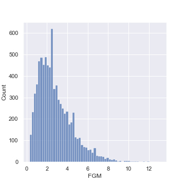

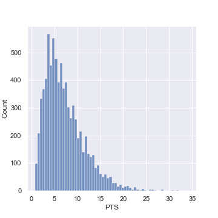

The skewness was removed from the Data by applying a cubed root to features that were found to have a skewness of greater than 1 or less than -1\. The data was heavily skewed to the right generally as such a cube root transformation was made on the following variables:

['AST', 'DREB', 'FTM', 'REB', 'OREB', 'FTA', 'FGM', 'PTS', 'FGA', 'STL', 'TOV', 'MIN']

Example features with skewness removed are below for comparison:

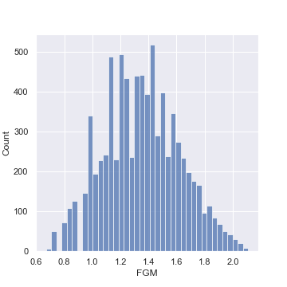

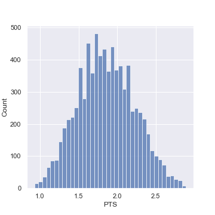

The remainder of the variables were not skewed or were within acceptable parameters.

### Removal of Outliers

The boxplot below demonstrates the number of outliers for each of the variables.

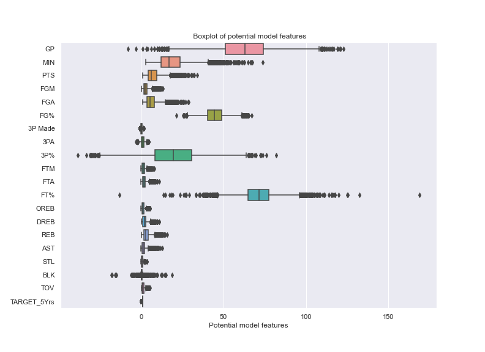

To remove the outliers from the Data the Tukeys method was used. This was done by taking both the probable and possible outliers and replacing them with the median. This was chosen as it is a robust method of dealing with outliers. The resultling boxplot is below for comparison.

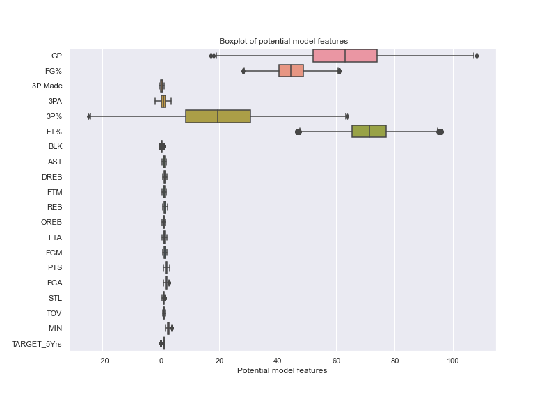

The resulting pair plot following both the removal of the skewness of and the treatment of the outliers is below.

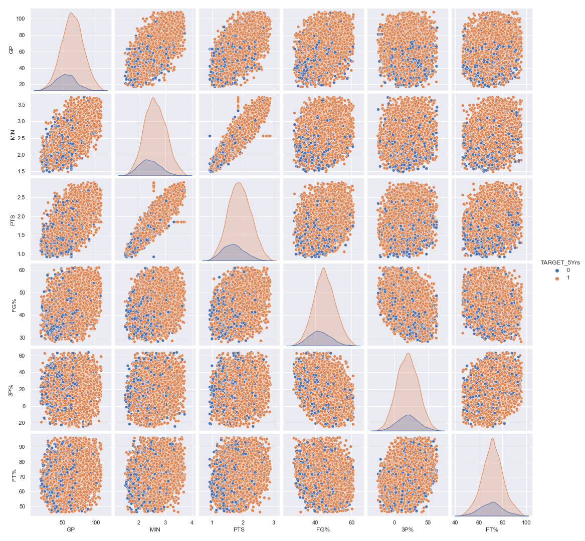

It can be seen that there are trends between the different classification in the features.

The final consideration in this experimental round was the imbalanced nature of the Data. The plot below highlights this.

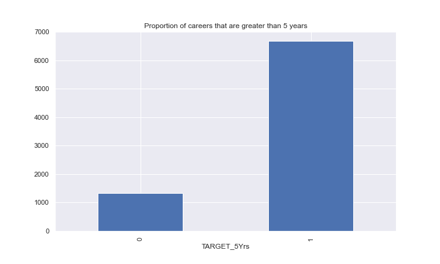

We can see that the target variable is unbalanced, to account for this SMOTE was used as an oversampling strategy.

## Modelling

The model was developed using the XGBoost algorithm. The model was developed in an additive manner whereby features were added to the model in order to ensure the best model was kept as simple as possible. The model parameters were as follows:

- max_depth=3,
- learning_rate=0.01,
- nfold=100,
- n_estimators=2500,
- subsample = .9,
- reg_alpha = .3,
- gamma = 10,
- colsample_bytree = 1,
- objective='binary:logistic',
- booster='gbtree')

# Experiment Results

The results of the experiment yielded a result of .6911 when they were submitted on the competition. This is close to the higher scores in the competition.

## Technical Performance

The model trained quickly (93 sec) and the performance of the test and train sets were comparable. The graphic below highlights the performance on the test data as part of the model performance.

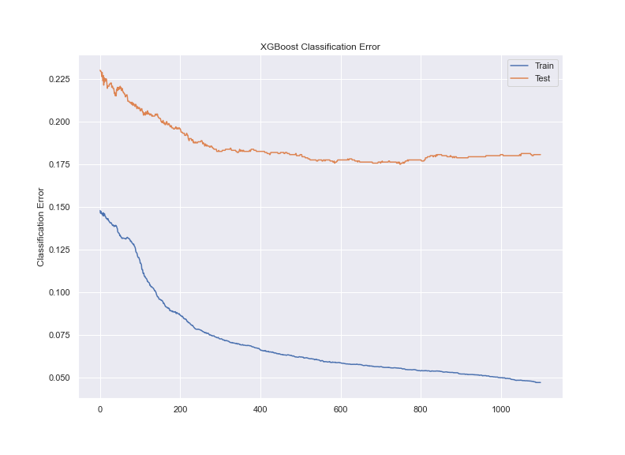

The confusion matrix below highlights the performance of the model on how the number of false positive and false negatives the model is producing.

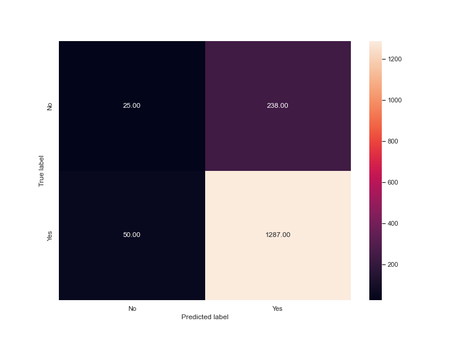

The implication is that there are 389 incorrectly categorised players from the test data. 300 are players that were considered to make the target career length but in fact don't make it that far.

## Business Impact

The impact of these errors is that investment and energy will be applied to players that are unlikely to reach the career milestone of 5 years.

## Encountered Issues

There were some issues with feature selection. The feature importance graph below highlights the relative importance of the features in the model.

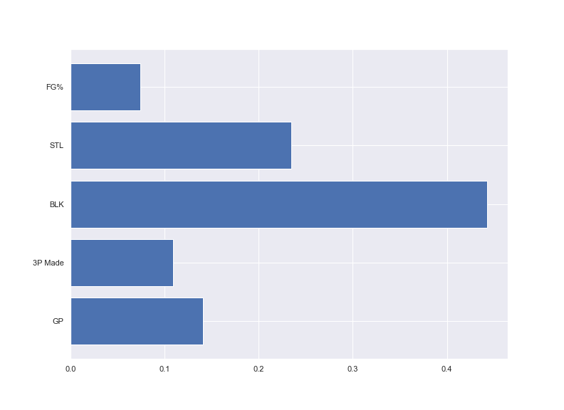

As different features were removed based on the results of this graphic the interactions between the variables were hard to predict and as such all features were kept in the model to offer a standard manner of selecting the features.

# Future Experiment

Feature selection is the next step in the process to ensure the model is both as simple as possible and explainable in business terms.

## Key Learning

The cleaning of both the outliers and the skewness in the Data will enable other models to be fit as part of future experiments. The parameters for the xgBoost model influence the outcome significantly - the parameters in the model above were a compromise between the processing speed and not overfitting the model.

## Recommendations

This model could be used in conjunction with other models to determine the best overall outcome for an individual player based on the Data gathered during the season.
